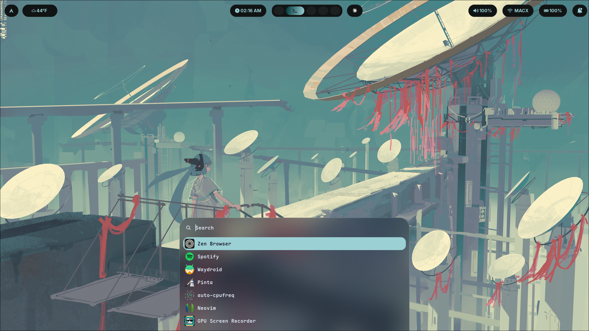

<div align="center">

<br>

# ☁️ cloud-dots

<p><i>a hyprland rice built around material you theming and dynamic color generation</i></p>

</div>

---

<p align="center">
  
</p>

---

## 🖥 stack

| role           | tool                        |
|----------------|-----------------------------|
| compositor     | hyprland-git                |
| terminal       | kitty                       |
| shell          | zsh                         |
| bar            | waybar                      |
| launcher       | rofi                        |
| wallpaper      | awww                        |
| notifications  | swaync                      |
| theming        | matugen 4.1.0               |
| editor         | neovim (nvchad) + vscodium  |
| browser        | zen-browser                 |
| files          | nautilus                    |
| lock           | hyprlock                    |
| fetch          | nitch                       |
| font           | maple mono nf cn            |
| icons          | tela-circle-dark            |

---

## ✨ features

- **fully dynamic theming**  
  colors generated via matugen and applied across:  
  hyprland, waybar, rofi, kitty, nvim, swaync, cava, vesktop, gtk, vscodium  

- **rofi control menu**  
  quick access to blur, corner, border, and animation presets  

- **per-app opacity toggle**  
  vscodium transparency controlled via keybind  

- **live nvim recoloring**  
  updates instantly on wallpaper change via unix socket  

- **awww wallpaper daemon**  
  smooth animated wave transitions  

---

## 🌫 aesthetic

- soft, rounded, low-contrast surfaces  
- material you dynamic palette  
- smooth animations and blur-heavy layering  
- cohesive typography using maple mono  

designed to feel calm, minimal, and fluid.

---

## 📁 structure


~/.config/
├── hypr/ # hyprland config + modules
├── waybar/ # bar config + styles
├── rofi/ # launcher theme + colors
├── kitty/ # terminal config
├── matugen/ # theming pipeline + templates
├── swaync/ # notification center
└── nvim/ # nvchad config

~/.local/bin/
└── scripts/ # rofi script menus + toggles


---

## 🎨 theming

colors are generated by matugen from the current wallpaper.

```bash
setwall ~/path/to/wallpaper.jpg
<div align="center"> <sub> built on arch linux · hyprland-git · nvidia 470xx <br> designed with ☁️ </sub> </div> ```